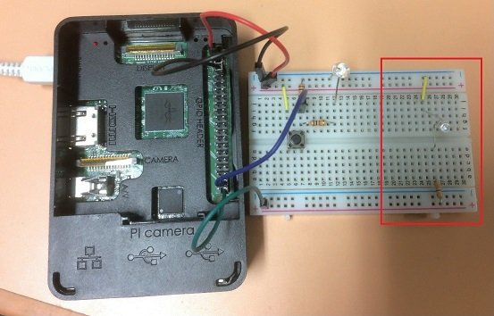
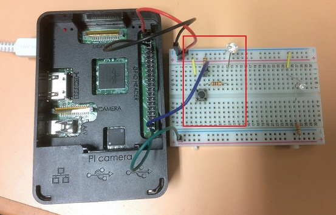

# RobotSystem2017HW-01
ロボットシステム学 課題1-デバイスドライバ作成

## 概要
1. `echo` コマンドでLチカ
1. `cat` コマンドでスイッチのステータス表示

## 課題内容
1. echoコマンドでLチカ
    * 授業と同様
        * `echo 1 >> /dev/swled0` でLEDがON
        * `echo 0 >> /dev/swled0` でLEDがOFF

    * GPIO21に以下のように接続(青色高輝度LED)

    
    
    * 制御内容
    1. GPFSEL2の5bit目から3bit目を001にする(Output mode)
    1. ユーザーランド(コンソール)に1が入力されたとき、GPSET0
       0が入力されたとき、GPCLR0の、LSBから21番目のbitを1にする

    * [動画1: Lチカ](https://youtu.be/CslaoA1eb30)
    * [動画2: Lチカ(コンソール画面)](https://youtu.be/X-081OScJBE)

1. catコマンドでスイッチのステータス表示
    * 追加課題
        * `cat /dev/swled0` でスイッチの状態を表示(ONのときに1、OFFのときに0)

    * GPIO20に以下のように接続(10kΩでプルダウン)
    * スイッチを押したことがわかるように赤色LEDを物理的に接続

    

    * 制御内容
    1. GPFSEL2の2bit目から0bit目を000にする(Input mode)
    1. GPPUDを01としプルダウンにする
    1. しばらく待つ
    1. GPPUDCLK0のLSBから20bit目を1にする(Assert Clock)
    1. しばらく待つ(設定を反映させるため)
    1. GPPUD、GPPUDCLKともに0にする
    1. 設定が完了すると、入力値によってGPLEV0のLSBから21bit目が変化するようになる

    * [動画3: スイッチ認識](https://youtu.be/V7vF-qqg9bc)
    * [動画4: スイッチ認識(コンソール画面)](https://youtu.be/lVNPugOPNds)

##ライセンス (LICENSE)
This program is licensed under GPLv2 - see the [LICENSE](LICENSE)
このプログラムはGPLv2でライセンスされています。条項は [LICENSE](LICENSE)を参照してください。
